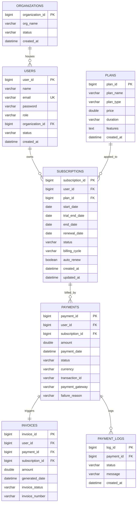

# Subscription-Based SaaS Billing System

A complete production-ready, multi-tenant Subscription-Based SaaS Billing System where organizations can register, manage team members, purchase subscription plans (with trial support), make payments through mock gateways (Stripe, PayPal, Razorpay), and view printable invoices.

---

## Technical Stack
* **Frontend**: HTML5, Vanilla CSS3 (Custom Glassmorphism design), Vanilla JS (ChartJS & FontAwesome)
* **Backend**: Spring Boot 3.x, JPA / Hibernate, Spring Security + JWT Auth, Springdoc OpenAPI
* **Database**: MySQL (version 8+)
* **API Testing**: Postman Collection (seeding templates)

---

## 1. Project Structure
```
saas-billing-system/
│
├── src/
│   ├── main/
│   │   ├── java/com/triplixtech/saas/
│   │   │   ├── config/            # OpenAPI/Swagger configs
│   │   │   ├── controller/        # REST Controllers (Auth, Plans, Subs, Payments, Admin)
│   │   │   ├── dto/              # Data Transfer Objects (Login, Signup, Metrics)
│   │   │   ├── entity/           # JPA Entities (User, Org, Plan, Sub, Payment, Invoice, Log)
│   │   │   ├── repository/       # Spring Data JPA repositories
│   │   │   ├── security/         # JWT Filters and Security Filter Chains
│   │   │   └── service/          # Business Logic services
│   │   └── resources/
│   │       ├── static/           # SPA Web UI (index.html, style.css, app.js)
│   │       └── application.properties
│   └── test/                     # Context integration tests
│
├── schema.sql                    # Database setup script
├── saas_billing_system.postman_collection.json
└── README.md
```

---

## 2. Entity Relationship (ER) Diagram


---

## 3. Database Schema DDL
The database tables script is saved in the root as [schema.sql](file:///C:/Users/abhis/Downloads/saas-billing-system/schema.sql). It automatically seeds:
1. Three pricing plans: **Basic Sandbox** (Free), **Developer Core** ($19.99), and **Business Suite** ($49.00).
2. A Default Super Admin account:
   * **Email**: `superadmin@apexflow.com`
   * **Password**: `admin123`

---

## 4. REST API Documentation Summary
The OpenAPI Swagger documentation is exposed dynamically. Once the server is running, load:
* **Swagger UI**: [http://localhost:8080/swagger-ui/index.html](http://localhost:8080/swagger-ui/index.html)
* **JSON Docs**: [http://localhost:8080/v3/api-docs](http://localhost:8080/v3/api-docs)

### Core Endpoints Table
| Method | Endpoint | Description | Mapped Authority |
|---|---|---|---|
| `POST` | `/auth/signup` | Register org + admin user | Public |
| `POST` | `/auth/login` | Login user, issues JWT token | Public |
| `GET` | `/plans` | List available pricing plans | Public |
| `POST` | `/plans` | Create a pricing plan | `SUPER_ADMIN` |
| `POST` | `/subscriptions/subscribe` | Register to a plan (Trial/Paid) | All authenticated |
| `POST` | `/subscriptions/{id}/cancel` | Cancel active renewal cycle | All authenticated |
| `POST` | `/payments/{id}/complete` | Mock success gateway capture | All authenticated |
| `POST` | `/payments/{id}/refund` | Simulate transaction refund | Admins |
| `GET` | `/invoices/user/{userId}` | Get invoices generated for user | Mapped User / Admin |
| `GET` | `/admin/dashboard/metrics` | Retrieve dashboard stats & graphs | `SUPER_ADMIN` / Admins |

---

## 5. Setup & Execution Guide

### Prerequisites
* Java JDK 21+
* Maven 3.x
* MySQL Server (running on port 3306)

### Step 1: Configure MySQL
Create a database named `saas_billing_system` or let Spring Boot automatically create it on startup (configured via `createDatabaseIfNotExist=true` in properties). Verify your credentials in `src/main/resources/application.properties`:
```properties
spring.datasource.username=root
spring.datasource.password=prachi@123
```

### Step 2: Compile & Run the Server
Open terminal in the project directory:
```powershell
# Compile & Run Unit Tests
.\mvnw.cmd clean test

# Run Application Server
.\mvnw.cmd spring-boot:run
```

### Step 3: Access UI Dashboard
Load the web client dashboard in your browser:
👉 **[http://localhost:8080/index.html](http://localhost:8080/index.html)**

---

## 6. Interview/Viva Questions & Answers

### Q1: What is multi-tenant database partitioning, and how is it handled here?
**A**: Multi-tenancy designates a single application codebase serving multiple customer groups (organizations). In this system, we use a *Shared Database / Shared Schema* approach. Tenants are logically isolated by mapping a foreign key `organization_id` on the `users` table, which keeps all transactions mapped safely to their company entities.

### Q2: Why did we map Subscriptions to Users instead of Organizations?
**A**: Mapping subscriptions to Users allows maximum product flexibility:
1. It supports B2C models where individual users purchase plans.
2. It allows B2B mapping where a user buys a seat/licence and represents their organization.
3. It simplifies individual user trials, auto-renewals, and personal statements without forcing complex corporate grouping for solo users.

### Q3: Explain how the 14-day Free Trial is implemented programmatically.
**A**: When a user selects a Free plan with `isTrial = true`, the `SubscriptionService` sets the status to `TRIAL`, configures `trialEndDate` and `endDate` to 14 days in the future, and saves it. It immediately bypasses payment gateway validation by inserting a mock successful `$0.00` payment record, instantly granting access.

### Q4: How does the auto-renewal process work under the hood?
**A**: A subscription record maintains `endDate` and `autoRenew` fields. In a production environment, a Spring Scheduler (`@Scheduled`) runs a nightly cron job querying subscriptions where `endDate = today` and `autoRenew = true`. It initiates a background payment capture. If payment succeeds, it increments `endDate` by one cycle and issues a new invoice.

### Q5: How is transaction safety guaranteed during payment settlements?
**A**: Transaction safety is governed by Spring's `@Transactional` annotation. When completing a payment, multiple tables are updated (Payments, Subscriptions, Invoices, PaymentLogs). If any database write fails (e.g. database disconnect during invoice generation), the entire operation rolls back, preventing corrupt states like "paid but subscription inactive".

### Q6: What is a JWT token, and what are its parts?
**A**: JSON Web Token (JWT) is a secure, compact standard for transmitting JSON claims. It consists of three parts separated by dots:
1. **Header**: Signature algorithm (e.g., HS256).
2. **Payload**: User email, roles, expiration time, and custom claims.
3. **Signature**: Hashed verification code using a secret key to prevent token tampering.

### Q7: How does JWT authentication filter requests?
**A**: The `JwtFilter` intercepts incoming requests. It reads the `Authorization` header, extracts the token string (removing the `Bearer ` prefix), validates it against our secret key, parses the email claims, and populates the `SecurityContextHolder` with authentication credentials before forwarding to REST controllers.

### Q8: Explain how a refund affects the billing lifecycle.
**A**: Calling the `/payments/{id}/refund` endpoint performs four synchronized actions:
1. Changes the `Payment` status to `REFUNDED`.
2. Cancels the associated `Subscription` status (`CANCELLED`).
3. Voids all associated `Invoices` status to `VOID`.
4. Appends a new trace `PaymentLog` record.

### Q9: Why is OpenAPI/Swagger important for SaaS billing APIs?
**A**: SaaS platforms require robust developer APIs so tenants can build integrations. Swagger generates interactive documentation dynamically, letting third-party developers review endpoints, models, authorization schemes, and execute tests directly from the browser.

### Q10: How do we prevent duplicate payments (Idempotency) in a SaaS gateway?
**A**: Idempotency is handled by checking unique transaction tokens. When initiating a payment, a unique `transactionId` is pre-assigned. If a network retry triggers the same payment request, the gateway service checks if a successful transaction already exists for that ID, blocking duplicate charges.
